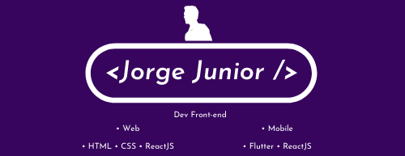

 
<h2>My currently occupations</h2>
<ul align="left"> 
    <li><b>Front-end and Mobile Developer</b> at <a href="https://www.evoluti.net.br/site/">EvoluTI</a></li>
    <li><b>Computer Engineering Student</b> at IFCE 🎓</li>
</ul>
 

<h2>My dev skills</h2>

    
    
    
    
    
        
    

 

    

